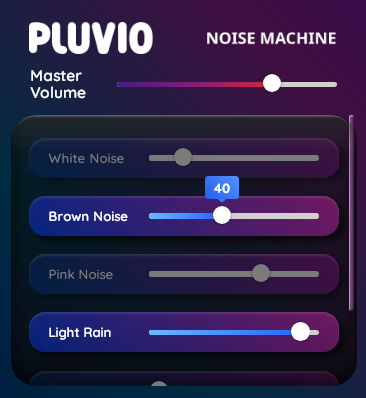

# Pluvio

I'm starting to build quick weekend apps.
this started as a comment one of my friends made about wanting to develop their skills by building an app.

I can't remember who said it first but they use a white noise machine on their desktop all the time to focus. Something they hacked together some time ago.

We came to the conclusion to make this the focus of this app.

Ideally with a removable back-end in something like rust and an optional front-end ui.

As they started work, I figured this would be a good exercise for me as well.

Originally I figured id use electron to build the front-end. Ik its a memory hog but if it works it works.

I found that there are a few good alternatives nowadays [tauri](https://tauri.app/) being one of them. It's a rust back-end with hooks to a minimal front-end; borrowing from whatever browser engine you already have installed. Making it incredibly light weight in comparison to electron.

Anyways, I have something working in tauri now. Im still working out some of the visual bugs on build vs dev.
But here it is! Ready to compile and use if you'd like

## Screenshots

here's what it looks like in version 0.1.0

---

## Source

You can [view the source here](https://github.com/signet-marigold/Pluvio)

still have some rendering bugs. but as far as i can tell in my limited testing its working on deb package debian 12, flatpak on debian 12, windows 10 and windows 11

this is in an early development stage. if you encounter any bugs please add and issue to the github.

## Updates

### [Febuary 27 - v0.1.0 Released](https://github.com/signet-marigold/Pluvio/releases/tag/v0.1.0)

### [March 02 - Dan's Rain Machine is Now Available](https://github.com/DanMyers300/rain-mixer)

### [March 08 - Flake Released](https://github.com/signet-marigold/pluvio-flake)
