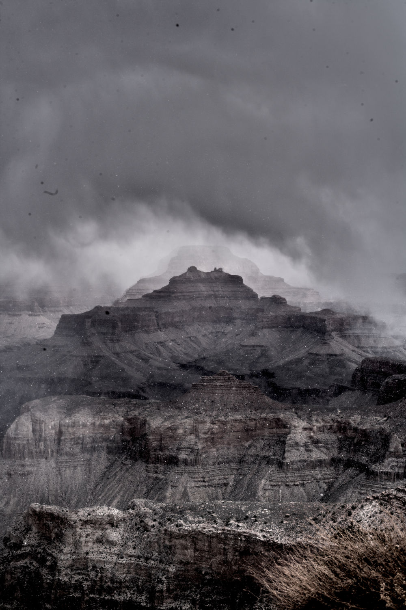
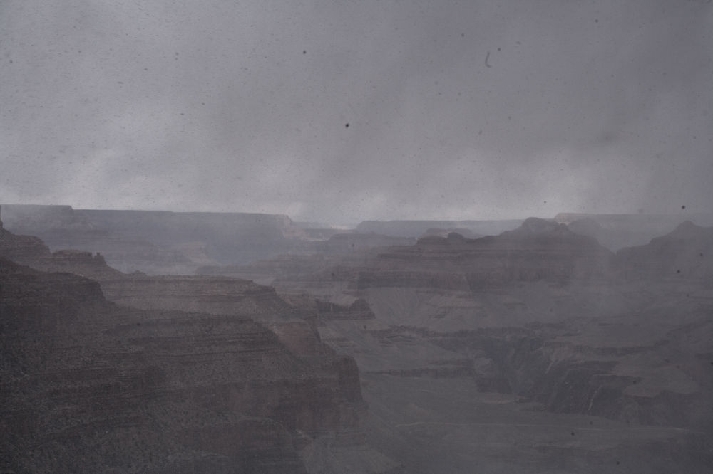
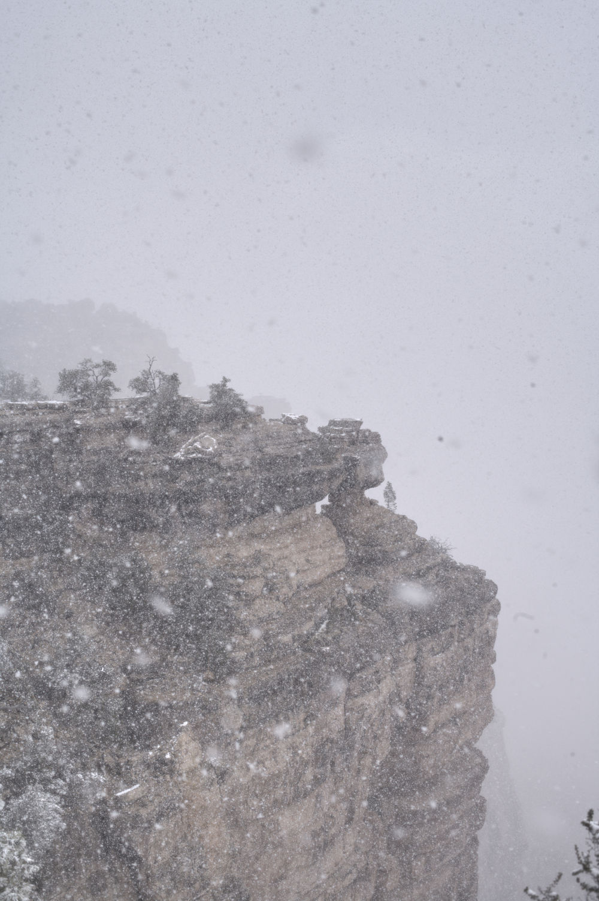

# Arizona trip 2025

## Grand canyon

^^^ wholy fuckin shit is the grand canyon

Just came back from the grand canyon.
Used a film roll, once that's developed ill show yall.
In the meantime I have some digital to post.

Man was it bloody cold. We always go at the least busy times of the year. and I wonder why.
Nice to see some snow. But fog was covering most of the views. I'm really hoping that the film comes back good.
I've been in a mood and want more moody shots so honestly i could not ask for better weather.

Since the breakup i've been reflecting on my life the past five years. Thinking about who I want to be. what parts of myself have i not expressed becuase of the people I was with?

I'm completly on my own for the first time, for better and for worse.
I'm not going to get into a rythmn for some time since this puts me in an ecomonically unstable position.
I could leave austin with very few ties; if i wanted.

i dont know... I guess i want to find being single to be a growing period.

more well adjusted.

in the meantime im going to be posting more. so stay tuned for that. Im working on my profesional career, physical health, mental health, journaling, personal life, and more...

Oh and that film roll is comming back soon and that will be its own post later. so stay tuned for that as well.
